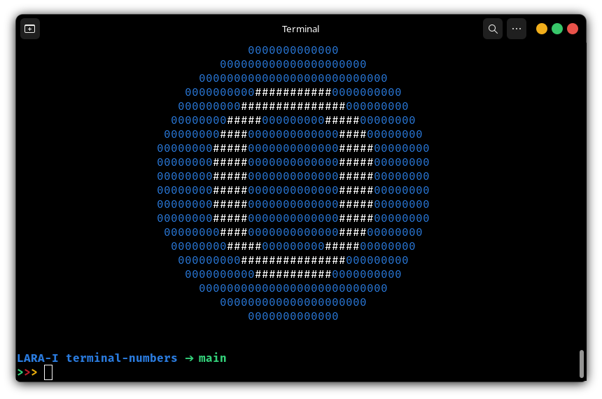

# Numbers in Terminal

|                           |                            |
|:-------------------------:|:--------------------------:|
|| |
|| |

python-script to display numbers centered in terminal

## Dependencies

```
python3
```
```
pip install termcolor
```

## Syntax

```
python3 numbers.py print_num number color_ring color_num
```
Example:
```
python3 numbers.py print_num 1 red white
```


## Code
```
from termcolor import colored
import sys
import shutil

num_heigt = 20

zero = ('              0000000000000              \n'
        '          000000000000000000000          \n' 
        '       000000000000000000000000000       \n' 
        '     0000000000###########0000000000     \n'
        '    000000000###############000000000    \n' 
        '   00000000#####000000000#####00000000   \n' 
        '  00000000####0000000000000####00000000  \n' 
        ' 00000000#####0000000000000#####00000000 \n'
        ' 00000000#####0000000000000#####00000000 \n' 
        ' 00000000#####0000000000000#####00000000 \n' 
        ' 00000000#####0000000000000#####00000000 \n'
        ' 00000000#####0000000000000#####00000000 \n'
        ' 00000000#####0000000000000#####00000000 \n' 
        '  00000000####0000000000000####00000000  \n' 
        '   00000000#####000000000#####00000000   \n' 
        '    000000000###############000000000    \n'
        '     0000000000###########0000000000     \n' 
        '       000000000000000000000000000       \n'
        '          000000000000000000000          \n'
        '              0000000000000              \n')

one =  ('              1111111111111              \n'
        '          111111111111111111111          \n' 
        '       111111111111111111111111111       \n' 
        '     111111111111#######111111111111     \n'
        '    111111111111########1111111111111    \n' 
        '   111111111111#########11111111111111   \n' 
        '  111111111111##########111111111111111  \n' 
        ' 111111111111###########1111111111111111 \n'
        ' 11111111111############1111111111111111 \n' 
        ' 1111111111111111#######1111111111111111 \n' 
        ' 1111111111111111#######1111111111111111 \n'
        ' 1111111111111111#######1111111111111111 \n'
        ' 1111111111111111#######1111111111111111 \n' 
        '  111111111111111#######111111111111111  \n' 
        '   11111111111111#######11111111111111   \n' 
        '    1111111111111#######1111111111111    \n'
        '     111111111111#######111111111111     \n' 
        '       111111111111111111111111111       \n'
        '          111111111111111111111          \n'
        '              1111111111111              \n')

two =  ('              2222222222222              \n'
        '          222222222222222222222          \n' 
        '       222222222222222222222222222       \n' 
        '     22222222############22222222222     \n'
        '    2222222################2222222222    \n' 
        '   2222222#####22222######222222222222   \n' 
        '  2222222#####222222#######222222222222  \n' 
        ' 22222222#####22222#######22222222222222 \n'
        ' 22222222222222222#######222222222222222 \n' 
        ' 2222222222222222#######2222222222222222 \n' 
        ' 222222222222222#######22222222222222222 \n'
        ' 22222222222222#######222222222222222222 \n'
        ' 2222222222222#######2222222222222222222 \n' 
        '  22222222222#######2222222222222222222  \n' 
        '   222222222#######2222222####22222222   \n' 
        '    2222222####################222222    \n'
        '     22222#####################22222     \n' 
        '       222222222222222222222222222       \n'
        '          222222222222222222222          \n'
        '              2222222222222              \n')

three= ('              3333333333333              \n'
        '          333333333333333333333          \n' 
        '       333333333333333333333333333       \n' 
        '     333333333#############333333333     \n'
        '    33333333#################33333333    \n' 
        '   3333333#####3333333333######3333333   \n' 
        '  333333333333333333333333#####33333333  \n' 
        ' 3333333333333333333333333#####333333333 \n'
        ' 333333333333333333333333#####3333333333 \n' 
        ' 333333333333333333#########333333333333 \n' 
        ' 333333333333333333#########333333333333 \n'
        ' 333333333333333333333333#####3333333333 \n'
        ' 3333333333333333333333333#####333333333 \n' 
        '  333333333333333333333333#####33333333  \n' 
        '   3333333#####3333333333######3333333   \n' 
        '    33333333#################33333333    \n'
        '     333333333#############333333333     \n' 
        '       333333333333333333333333333       \n'
        '          333333333333333333333          \n'
        '              3333333333333              \n')

def print_centre_colored(string, color_ring, color_num):
    centre_line = int((shutil.get_terminal_size().lines-num_heigt)/2)
    string_hcentre = "".join(line.center(shutil.get_terminal_size().columns)  for line in string.split("\n"))
    string_centre = '\n'*centre_line + string_hcentre + '\n'*centre_line
    
    for element in range(0, len(string_centre)):
        
        if string_centre[element] == '#':
            print(colored(string_centre[element], color_num), end = '')
        else:
            print(colored(string_centre[element], color_ring), end = '')
            

def print_num(number, color_ring, color_num):
    
    if number == '0':
        print_centre_colored(zero, color_ring, color_num)
    elif number == '1':
        print_centre_colored(one, color_ring, color_num)
    elif number == '2':
        print_centre_colored(two, color_ring, color_num)
    elif number == '3':
        print_centre_colored(three, color_ring, color_num)
    
if __name__ == "__main__":
    args = sys.argv
    globals()[args[1]](*args[2:])
    
'''
scheme = ('              #############              \n'
          '          #####################          \n' 
          '       ###########################       \n' 
          '     ###############################     \n'
          '    #################################    \n' 
          '   ###################################   \n' 
          '  #####################################  \n' 
          ' ####################################### \n'
          ' ####################################### \n' 
          ' ####################################### \n' 
          ' ####################################### \n'
          ' ####################################### \n'
          ' ####################################### \n' 
          '  #####################################  \n' 
          '   ###################################   \n' 
          '    #################################    \n'
          '     ###############################     \n' 
          '       ###########################       \n'
          '          #####################          \n'
          '              #############              \n')'''
```